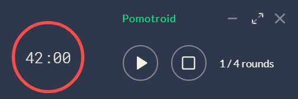

<div align="center">
  
</div>
<div align="center">
  
</div>
<div align="center">
  
</div>

<p align="center">Simple and visually-pleasing Pomodoro timer.</p>

---

[](https://travis-ci.org/karimdaghari/pomotroid)

## Note

This a fork of [Splode/Pomotroid](https://github.com/Splode/pomotroid). The project has been inactive for over a year so I guess it's safe to assume it's dead. But that's the beauty of FOSS ! It's about passing the baton.

## Overview

Pomotroid is a simple and customizable Pomodoro timer. It aims to aid your focus.

## Features

- Customizable times and number of rounds -- Sensible defaults are provided tho
- Persistant window
- Charming timer alert sounds
- Desktop notifications
- Minimize to tray
- Mini-mode

## Roadmap

Future plans for enhancements and development: Check issue #2

## Download

Pomotroid is available for Windows 32/64, Mac OSX and Debian/Ubuntu flavored Linux.

Download the latest version from the [releases](https://github.com/karimdaghari/pomotroid/releases) page.

## Technical

Pomotroid is built with [Vue.js](https://github.com/vuejs/vue), [Electron](https://github.com/electron/electron), and [electron-vue](https://github.com/SimulatedGREG/electron-vue).

_Note: depending on your OS settings, you may receive a security warning upon installation. This has to do with Pomotroid being an unsigned application. You can find out more by researching code-signing for Apple and Microsoft._

### Build Setup

```bash
# install dependencies
npm i

# serve with hot reload at localhost:9080
npm run dev

# build Pomotroid for production
npm run build

# Locally:
# Linux: builds for Linux and OS X
# Windows: builds only for Windows
# But you should be using a CI anyway
```

## Q & A

**Why isn't there any todo feature included ?**

> For context: (original) For the pomodoro timer to be effective, there needs to be a todo list.

I personally am a todo list kinda guy so trust me I'm aware of its importance, however, I've found that having a seperate todo app is way better for many reasons, to cite a few:

1. Checking a todo on a list makes your brain secrete dopamine,
2. You're likely to have more than one **list** which defeats the purpose: monotasking,
3. The app would become bloated as it'll actually become two apps in one: Pomodoro + Todo.

**Why isn't there any stats feature included ?**

Let me make myself clear from the get go, I don't think I will implement a stats feature, not that I hate stats, however, I believe that incorporating stats in such an app would be optimizing productivity for productivity's sake and that's missing the point because in my view, the point of being productive is to become as effective/efficient as possible.

_What effectiveness/effeciency means depends on the context. For example, in the context of a business, being effective means making money. If you're not making money, you're not efficient period._

**I don't like the design. Can't you change it ?**

I can, but I happen to like it. It's functional and, function > form. So, if you _really_ don't like it, please, by all means fork the repo and add your touch !

## License

MIT &copy; [Karim Daghari](https://github.com/karimdaghari)
